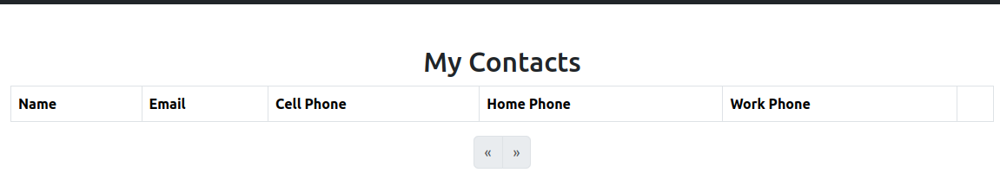
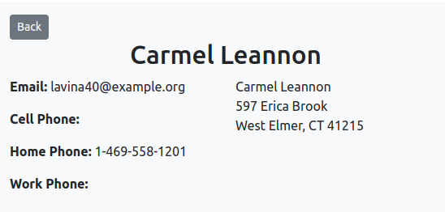

<h1 style="font-size: 50px; text-align: center;">Database Seeders</h1>

## Table of contents
1. [Overview](#overview)
2. [Creating a Seeder Class](#seeder-class)
3. [Setting Up the Seeder Class](#seeder-class-setup)
4. [Setting Up the DatabaseSeeder Class](#database-seeder)
5. [Running a Database Seeder](#running-seeder)
6. [Image Seeding](#image-seeding)
<br>
<br>

## 1. Overview <a id="overview"></a><span style="float: right; font-size: 14px; padding-top: 15px;">[Table of Contents](#table-of-contents)</span>
This framework supports the ability to seed a database with fake data utilizing a package called FakerPHP.  Consult their documentation [here](https://fakerphp.org/) for more information about what they support.  Using this package, along with the native support for Seeder classes you are able to populate tables in your database with test seeder data.  The list of third-party libraries can be found [here](https://fakerphp.org/third-party/).
<br>

## 2. Creating a Seeder Class <a id="seeder-class"></a><span style="float: right; font-size: 14px; padding-top: 15px;">[Table of Contents](#table-of-contents)</span>
You can easily create a new database seeder by running the the make:seeder console command.  This command has the following format:

```sh
php console make:seeder ${seederName}
```

The seederName is the name of your model and the table you want to populate with data.  We will use the Contact management system as an example.  Running the following command,

```sh
php console make:seeder Contacts
```

will result in a new file called ContactsTableSeeder being created at `database/seeders/`.  The resulting template file is shown below.

```php
namespace Database\Seeders;

use Faker\Factory as Faker;
use Core\Lib\Database\Seeder;
use Console\Helpers\Tools;

// Import your model
use App\Models\Contacts;

/**
 * Seeder for contacts table.
 * 
 * @return void
 */
class ContactsTableSeeder extends Seeder {
    /**
     * Runs the database seeder
     *
     * @return void
     */
    public function run(): void {
        $faker = Faker::create();
        
        // Set number of records to create.
        $numberOfRecords = 10;
        $i = 0;
        while($i < $numberOfRecords) {
            $contacts = new Contacts();
            

            if($contacts->save()) {
                $i++;
            }
        }
        Tools::info("Seeded contacts table.");
    }
}
```

This file contains the run function that does the actual work and all of the imports needed to get started.
<br>

## 3. Setting up The Seeder Class <a id="seeder-class-setup"></a><span style="float: right; font-size: 14px; padding-top: 15px;">[Table of Contents](#table-of-contents)</span>
We will focus on the following code for a completed run function.

```php
public function run(): void {
    $faker = Faker::create('en_us');
    
    $numberOfRecords = 10;
    $i = 0;
    while($i < $numberOfRecords) {
        $contact = new Contacts();
        $contact->fname = $faker->firstName;
        $contact->lname = $faker->lastName;
        $contact->email = $faker->unique()->safeEmail;
        $contact->address = $faker->streetAddress;
        $contact->city = $faker->city;
        $contact->state = $faker->stateAbbr;
        $contact->zip = $faker->postcode;
        $contact->home_phone = $faker->phoneNumber;
        $contact->user_id = 1;

        if($contact->save()) {
            $i++;
        }
    }
    Tools::info("Seeded contacts table.");
}
```

The call to create a new Faker Factory uses a static function called create.  In our case we include 'en_us' as a locality since we are making contacts for "people" who are United States residents.  This will ensure information such as state and zip follow US Postal Service standards.

The variable `$numberOfRecords` is set to 10 by default.  You can change this to any positive integer within reason for your case.  The while loop contains statements for creating a contact and setting fake data to database fields.  The if statement at the end is really important because the incrementor statement will be executed only when there is a successful save operation.  This ensures the number of records you need are indeed created.
<br>

## 4. Setting Up the DatabaseSeeder Class <a id="database-seeder"></a><span style="float: right; font-size: 14px; padding-top: 15px;">[Table of Contents](#table-of-contents)</span>
Before we can run the database seeder we need to update the DatabaseSeeder class.  It is found in the same directory as the class that we created above.  You will need to perform the imports and add the function calls in the order you want database seeding to occur.  A properly setup example is shown below:

```php
namespace Database\Seeders;

use Core\Lib\Database\Seeder;
use Database\Seeders\ContactsTableSeeder;

/**
 * Supports ability to call seeder classes.
 */
class DatabaseSeeder extends Seeder {
    /**
     * Call individual seeders in proper order.
     *
     * @return void
     */
    public function run(): void {
        $this->call(ContactsTableSeeder::class);
    }
}
```

Notice that we need to include a use statements for each seeder we want to use.  Within the run function is a call to the `call` function of the Seeder class.  This is where the mechanics of database seeding operations occurs.
<br>

## 5. Running a Database Seeder <a id="running-seeder"></a><span style="float: right; font-size: 14px; padding-top: 15px;">[Table of Contents](#table-of-contents)</span>
We are finally ready to perform database seeding.  Let's look at the index view of the contacts management system before we start.

<div style="text-align: center;">
  
  <p style="font-style: italic;">Figure 1 - Contacts' index view with no data</p>
</div>

As shown above in Figure 1 we have the index view with no seeders.  Since the Contacts Management System is a testbed for testing development efforts we will want to populate this page with dummy data.  Let's suppose we want to test pagination so we will want to create 20 records.  Run the command below to seed the contacts table.

```sh
php console seed:run
```

After running the command you will see a series of messages describing our task as shown below in Figure 2.

<div style="text-align: center;">
  
  <p style="font-style: italic;">Figure 2 - Database seeding console output</p>
</div>

Finally, upon inspection of the Contacts' index we will see that the database has been seeded with 20 entries.  Thus, we can go ahead and test the pagination feature.  The example view is shown below in Figure 3.

<div style="text-align: center;">
  
  <p style="font-style: italic;">Figure 3 - Contacts' index view after seeder operation</p>
</div>

But viewing the Contacts' index view is just one phase of our testing.  We need to click the links for a few of our contacts to make sure the contact information card has the information we expect.  Let's click on the link for our contact, Carmel Leannon, to see their details.

<div style="text-align: center;">
  
  <p style="font-style: italic;">Figure 4 - Carmel Leannon's contact information</p>
</div>

As shown above in Figure 4, we can see that Carmel's information looks like we would expect.  It contains a valid street address along with a city, state, and zip code that matches USPS standards.  The first name and last name makes sense despite it being completely made up.  Finally, the email and phone number matches a valid format.
<br>

## 5. Image Seeding <a id="image-seeding"></a><span style="float: right; font-size: 14px; padding-top: 15px;">[Table of Contents](#table-of-contents)</span>
Seeding records for images and uploading them requires a few extra steps.  You will need to use a third-party library called `Smknstd\FakerPicsumImages`.  Let's go over this example for profile images.

```php
public function run(): void {
    $faker = Faker::create();
    $faker->addProvider(new FakerPicsumImagesProvider($faker));

    // Generate a unique image filename
    $userId = 1;
    $basePath = 'storage' . DS . 'app' . DS . 'private' . DS . 'profile_images' . DS;
    $uploadPath = $basePath . 'user_' . $userId . DS;
    
    // Set number of records to create.
    $numberOfRecords = 10;
    $i = 0;
    while($i < $numberOfRecords) {
        // Ensure the directory exists
        if (!file_exists($uploadPath)) {
            mkdir($uploadPath, 0777, true);
        }

        // Generate the image and get the actual filename from Faker
        $actualFilePath = $faker->image($uploadPath, 200, 200, false, null, false, 'jpg');
        
        // Extract only the filename
        $imageFileName = basename($actualFilePath);

        // Create ProfileImages record
        $profileImage = new ProfileImages();
        $profileImage->user_id = $userId;
        $profileImage->sort = $i;
        $profileImage->name = $imageFileName;

        // Correct the database URL to match form-uploaded images
        $profileImage->url = $uploadPath . $imageFileName;

        if ($profileImage->save()) {
            Tools::info("Saved profile image record: $imageFileName");
            $i++;
        } else {
            Tools::info("Failed to save profile image record: $imageFileName");
            Tools::info("Validation Errors: " . json_encode($profileImage->getErrorMessages()));
        }
    }

    Tools::info("Finished seeding profileImage table.");
}
```

You will need to import the third-party library, `use Smknstd\FakerPicsumImages\FakerPicsumImagesProvider;`, and manage where the file will be uploaded.  If the files do get saved but you are having trouble accessing them make sure the upload path is correct.  

When uploading the image using the `$faker->image` function call we set the path, hight, width, and file type.  Next we setup information for the record.  Finally se save the file and produce the appropriate output messages.