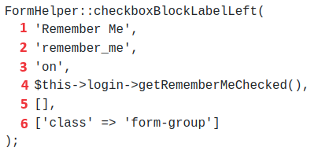
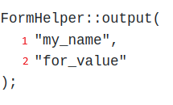

<h1 style="font-size: 50px; text-align: center;">Forms</h1>

## Table of contents
1. [Overview](#overview)
2. [button](#button)
3. [buttonBlock](#buttonblock)
4. [checkboxBlockLabelLeft](#checkboxBlockLabelLeft)
5. [checkboxBlockLabelRight](#checkboxblocklabelright)
6. [csrfInput](#csrfinput)
7. [displayError](#displayerrors)
8. [emailBlock](#emailblock)
9. [hidden](#hidden)
10. [inputBlock](#inputblock)
11. [output](#output)
12. [radioInput](#radioinput)
13. [selectBlock](#selectblock)
14. [submitBlock](#submitblock)
15. [submitTag](#submittag)
16. [telBlock](#telblock)
17. [textAreaBlock](#textareablock)
<br>
<br>

## 1. Overview <a id="overview"></a><span style="float: right; font-size: 14px; padding-top: 15px;">[Table of Contents](#table-of-contents)</span>
The Rapid Forms feature of this Model View Controller (MVC) Framework allows the user to quickly create and style forms. This guide thoroughly describes the ability to create these HTML form elements along with a description and examples. All form inputs will automatically be sanitized and validation checks will be performed.  If you would like support for additional features please create an issue [here](https://github.com/chapmancbVCU/chappy-php-framework/issues).
<br>

## 2. button <a id="button"></a><span style="float: right; font-size: 14px; padding-top: 15px;">[Table of Contents](#table-of-contents)</span>
This function creates a button with no surrounding HTML div element. It supports the ability to set attributes such as classes and event handlers. If you want a div to surround a button along with any other attributes we recommend that you use the buttonBlock function. Note the example function call shown below in Figure 1.

<div style="text-align: center;">
  
  <p style="font-style: italic;">Figure 1 - Example button function call</p>
</div>

This function accepts 2 arguments as described below:
1. $buttonText is used to set the text of the button.
2. $inputAttrs is an array and can be found in most function calls. We use this parameter to set values for attributes such as classes for styling, front-side validation, and event handlers. Make sure when performing an event handler function call that contains strings as arguments to escape any quotes. The default value is an empty array.
<br>

## 3. buttonBlock <a id="buttonBlock"></a><span style="float: right; font-size: 14px; padding-top: 15px;">[Table of Contents](#table-of-contents)</span>
The buttonBlock function is a wrapper for the button function that adds a div around the button element. An example function call is shown below in Figure 2.

<div style="text-align: center;">
  
  <p style="font-style: italic;">Figure 2 - Example buttonBlock function call</p>
</div>

This function accepts 3 arguments as described below:
1. $buttonText is used to set the text of the button.
2. $inputAttrs is an array and can be found in most function calls. We use this parameter to set values for attributes such as classes for styling, front-side validation, and event handlers. Make sure when performing an event handler function call that contains strings as arguments to escape any quotes. The default value is an empty array.
3. $divAttrs is an array whose primary purpose is to add classes for styling the div that surrounds the button element. The default value is an empty array.
<br>

## 4. checkboxBlockLabelLeft <a id="checkboxBlockLabelLeft"></a><span style="float: right; font-size: 14px; padding-top: 15px;">[Table of Contents](#table-of-contents)</span>
Generates a checkbox where the label is on the left side. It generates a div element that surrounds a label and input of type checkbox. This is idea for situations where labels can be of varying lengths. An example function call is shown below in Figure 3.

<div style="text-align: center;">
  
  <p style="font-style: italic;">Figure 3 - Example checkboxBlockLabelLeft function call</p>
</div>

This function accepts 6 arguments as described below:
1. $label is used to set the text of the label element.
2. $name sets the value for the name, for, and id attributes.
3. $value sets the value for the data received upon form submit. The default value is an empty string.
4. $checked is used to set a value of checked for a checkbox. This value can be set upon reading information from a database or upon 5. failed form validation.
5. $inputAttrs is an array and can be found in most function calls. We use this parameter to set values for attributes such as classes for styling, front-side validation, and event handlers. The default value is an empty array.
6. $divAttrs is an array whose primary purpose is to add classes for styling the div that surrounds the input element. The default value is an empty array.
7. $errors The errors array. Default value is an empty array.
<br>

## 5. checkboxBlockLabelRight <a id="checkboxBlockLabelRight"></a><span style="float: right; font-size: 14px; padding-top: 15px;">[Table of Contents](#table-of-contents)</span>
Generates a checkbox where the label is on the left side. It generates a div element that surrounds a label and input of type checkbox. An example function call from the login view is shown below in Figure 4.
<div style="text-align: center;">
  
  <p style="font-style: italic;">Figure 4 - Example checkboxBlockLabelRight function call</p>
</div>

This function accepts 6 arguments as described below:
1. $label is used to set the text of the label element.
2. $name sets the value for the name, for, and id attributes.
3. $value sets the value for the data received upon form submit. The default value is an empty string.
4. $checked is used to set a value of checked for a checkbox. This value can be set upon reading information from a database or upon 5. failed form validation.
5. $inputAttrs is an array and can be found in most function calls. We use this parameter to set values for attributes such as classes for styling, front-side validation, and event handlers. The default value is an empty array.
6. $divAttrs is an array whose primary purpose is to add classes for styling the div that surrounds the input element. The default value is an empty array.
7. $errors The errors array. Default value is an empty array.
<br>

## 6. csrfInput <a id="csrfInput"></a><span style="float: right; font-size: 14px; padding-top: 15px;">[Table of Contents](#table-of-contents)</span>
Generates a CRSF token as the value for an input of type hidden. The token is randomly generated and is used to verify if any tampering of any form has been performed. Use this function to assist in preventing CSRF attacks. The CRSF token is unique for every user session and is a sufficiently large string of random values.
<br>

## 7. displayErrors <a id="displayErrors"></a><span style="float: right; font-size: 14px; padding-top: 15px;">[Table of Contents](#table-of-contents)</span>
The purpose of this function is to display errors related to validation. An example can be found in Figure 5.

<div style="text-align: center;">
  
  <p style="font-style: italic;">Figure 5 - Display errors example</p>
</div>
<br>

## 8. emailBlock <a id="emailBlock"></a><span style="float: right; font-size: 14px; padding-top: 15px;">[Table of Contents](#table-of-contents)</span>
Use this function to create styled E-mail form inputs. An example function call is shown below in Figure 6.

<div style="text-align: center;">
  
  <p style="font-style: italic;">Figure 6 - E-mail block example function call</p>
</div>

This function accepts 6 arguments as described below:
1. $label is used to set the text of the label element.
2. $name sets the value for the name, for, and id attributes.
The value we want to set. We can use this to set the value of the value attribute during form validation. Default value is the empty 3. string. It can be set with values during form validation and forms used for editing records.
4. $inputAttrs The values used to set the class and other attributes of the input string. The default value is an empty array.
5. $divAttrs The values used to set the class and other attributes of the surrounding div. The default value is an empty array.
6. $errors The errors array. Default value is an empty array.
<br>

## 9. hidden <a id="hidden"></a><span style="float: right; font-size: 14px; padding-top: 15px;">[Table of Contents](#table-of-contents)</span>
Generates a hidden element. An example function call is shown below in figure 7:

<div style="text-align: center;">
  
  <p style="font-style: italic;">Figure 7 - Hidden input function call</p>
</div>

This function accepts 2 arguments as described below:
1. $name sets the value for the name, for, and id attributes.
2. $value The value for the value attribute.
<br>

## 10. inputBlock <a id="inputBlock"></a><span style="float: right; font-size: 14px; padding-top: 15px;">[Table of Contents](#table-of-contents)</span>
1. A generic input block that supports the following input types:
2. Color
3. date
4. datetime-local
5. email
6. file
7. month
8. number
9. password
10. range
11. search
12. tel
13. text
14. time
15. url
16. week

An example function call is show below in figure 8:
<div style="text-align: center;">
  
  <p style="font-style: italic;">Figure 8 - Input block function call</p>
</div>

This function accepts 7 arguments as described below:
1. $type The input type we want to generate.
2. $label is used to set the text of the label element.
3. $name sets the value for the name, for, and id attributes.
4. $value The value we want to set. We can use this to set the value of the value attribute during form validation. Default value is the empty string. It can be set with values during form validation and forms used for editing records.
5. $inputAttrs The values used to set the class and other attributes of the input string. The default value is an empty array.
6. $divAttrs The values used to set the class and other attributes of the surrounding div. The default value is an empty array.
7. $errors The errors array. Default value is an empty array.
<br>

## 11. output <a id="output"></a><span style="float: right; font-size: 14px; padding-top: 15px;">[Table of Contents](#table-of-contents)</span>
Generates an HTML output element. The output element is a container that can inject the results of a calculator or the outcome of a user action. An example function call is shown below in figure 9:
<div style="text-align: center;">
  
  <p style="font-style: italic;">Figure 9 - Output element function call</p>
</div>

This function accepts 2 arguments as described below:
1. $name Sets the value for the name attributes for this
2. $for Sets the value for the for attribute.
<br>

## 12. radioInput <a id="radioInput"></a><span style="float: right; font-size: 14px; padding-top: 15px;">[Table of Contents](#table-of-contents)</span>
Creates an input element of type radio with an accompanying label element. Compatible with radio button groups.  An example function call is shown below in figure 10:
<div style="text-align: center;">
  
  <p style="font-style: italic;">Figure 10 - Radio button function call</p>
</div>

This function accepts 2 arguments as described below:
1. $label Sets the label for this input.
2. $id	The id attribute for the radio input element.
3. $name	Sets the value for the name, for, and id attributes for this input.
4. $value The value we want to set. We can use this to set the value of the value attribute during form validation. Default value is the empty string. It can be set with values during form validation and forms used for editing records.
5. $checked The value for the checked attribute. If true this attribute will be set as checked="checked". The default value is false. It can be set with values during form validation and forms used for editing records.
6. $inputAttrs	The values used to set the class and other attributes of the input string. The default value is an empty array.

The example code below demonstrates how a radio button groups is used.
```php
FormHelper::radioInput('HTML', 'html', 'fav_language', "HTML", $check1, ['class' => 'form-group mr-1']); 
FormHelper::radioInput('CSS', 'css', 'fav_language', "CSS", $check2, ['class' => 'form-group mr-1']);
```
<br>

## 13. selectBlock <a id="selectBlock"></a><span style="float: right; font-size: 14px; padding-top: 15px;">[Table of Contents](#table-of-contents)</span>
Renders a select element with a list of options.  An example function call is shown below in figure 11: 
<div style="text-align: center;">
  
  <p style="font-style: italic;">Figure 11 - Select block function call</p>
</div>

This function accepts 7 arguments as described below:
1. $label Sets the label for this input.
2. $name Sets the value for the name, for, and id attributes for this input.
3. $value The value we want to set as selected.
4. $inputAttrs The values used to set the class and other attributes of the input string.  The default value is an empty array.
5. $options The list of options we will use to populate the select option dropdown.  The default value is an empty array.
6. $divAttrs The values used to set the class and other attributes of the surrounding div.  The default value is an empty array.
6. $errors The errors array.  Default value is an empty array.
<br>

## 14. submitBlock <a id="submitBlock"></a><span style="float: right; font-size: 14px; padding-top: 15px;">[Table of Contents](#table-of-contents)</span>
Generates a div containing an input of type submit.
<br>

## 15. submitTag <a id="submitTag"></a><span style="float: right; font-size: 14px; padding-top: 15px;">[Table of Contents](#table-of-contents)</span>
Create a input element of type submit.
<br>

## 16. telBlock <a id="telBlock"></a><span style="float: right; font-size: 14px; padding-top: 15px;">[Table of Contents](#table-of-contents)</span>
Renders an HTML div element that surrounds an input of type tel. The user is able to enter cell, home, and work as phone types. Certain options can be set using the args parameter.

Option parameters that are supported:
1. a - All default options turned on.
2. d - All options are off.
3. e - Default event listener turned on for enforcing phone format requirements.
4. h - Default placeholder turned on.
5. p - Default telephone pattern is enforced.

The user may use 'a', or any combination of 'h', 'p', or 'e'. The empty string is not a valid value for args. Leaving out a value for args in the function call will cause all defaults to be turned on. If the d is entered with all other valid options together will cause no options to be set. If bad phone types and args values are entered exceptions displaying relevant information will be thrown.

An example function call where no arguments are set is shown below: 
```php
FormHelper::telBlock('cell', 'Cell Phone', 'cell_phone', $this->contact->cell_phone, ['class' => 'form-control'], ['class' => 'form-group col-md-6']);
```

An example function call where two options are set and other is set with the inputAttrs array is shown below:
```php
FormHelper::telBlock('home', 'Home Phone', 'home_phone', $this->contact->home_phone, ['class' => 'form-control', 'placeholder' => 'My placeholder'], ['class' => 'form-group col-md-6'],"pe");
```

An example function call where 'a' flag is set is shown below:
```php
FormHelper::telBlock('work', 'Work Phone', 'work_phone', $this->contact->work_phone, ['class' => 'form-control'], ['class' => 'form-group col-md-6'], "a");
```

This function accepts 8 arguments as described below:
1. $phoneTypeThe type of phone that can be used. We currently support "cell", "home", and "work" type phones.
2. $label  Sets the label for this input.
3. $name	Sets the value for the name, for, and id attributes for this input.
4. $valueThe value we want to set. We can use this to set the value of the value attribute during form validation. Default value is the empty string. It can be set with values during form validation and forms used for editing records.
5. $inputAttrs	The values used to set the class and other attributes of the input string. The default value is an empty array.
6. $divAttrs	The values used to set the class and other attributes of the surrounding div. The default value is an empty array.
7. $args	Arguments that influence which options are turned on.
8. $errors	The errors array. Default value is an empty array.
<br>

## 17. textAreaBlock <a id="textAreaBlock"></a><span style="float: right; font-size: 14px; padding-top: 15px;">[Table of Contents](#table-of-contents)</span>
Assists in the development of textarea in forms. It accepts parameters for setting attribute tags in the form section.  An example function call is shown below in figure 12:
<div style="text-align: center;">
  
  <p style="font-style: italic;">Figure 12 - TextArea block function call</p>
</div>

This function accepts 6 arguments as described below:
1. $label Sets the label for this input.
2. $name Sets the value for the name, for, and id attributes for this input.
3. $value The value we want to set. We can use this to set the value of the value attribute during form validation. Default value is the empty string. It can be set with values during form validation and forms used for editing records.
4. $inputAttrs	The values used to set the class and other attributes of the input string. The default value is an empty array.
5. $divAttrs	The values used to set the class and other attributes of the surrounding div. The default value is an empty array.
6. $errors	The errors array. Default value is an empty array.