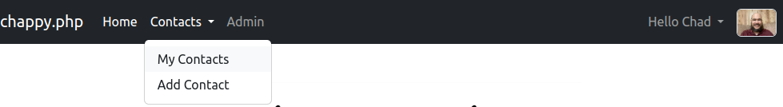
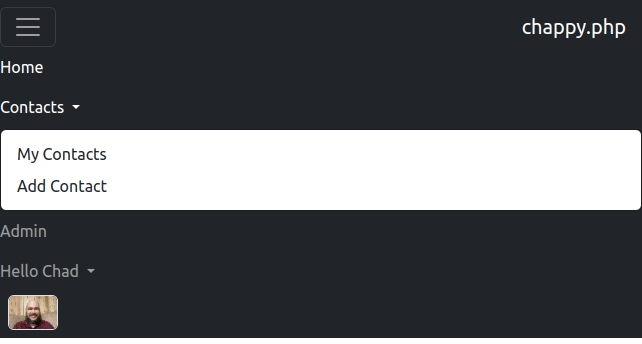

<h1 style="font-size: 50px; text-align: center;">Navigation Bar</h1>

## Table of contents
1. [Overview](#overview)
2. [Navigation Bar Layout](#layout)
<br>
<br>

## 1. Overview <a id="overview"></a><span style="float: right; font-size: 14px; padding-top: 15px;">[Table of Contents](#table-of-contents)</span>
The navigation bar is supported by Bootstrap 5 and is responsive based on the size of the viewport.  The configuration of the navigation bar is based on a `menu_acl` json file.  More about creating these files can be found [here](layouts#menu-acls)

Lets look at our most complex example.

```json
{
    "Home" : "home",
    "Contacts" : {
        "My Contacts" : "contacts",
        "Add Contact" : "contacts/add"
    },
    "Admin" : "admindashboard/index"
}
```

The menu associated with this file is shown below in Figure 1.

<div style="text-align: center;">
  
  <p style="font-style: italic;">Figure 1 - Navigation bar with open menu</p>
</div>

Figure 2 shows the menu bar but in a configuration for mobile devices.

<div style="text-align: center;">
  
  <p style="font-style: italic;">Figure 2 - Mobile navigation bar with open menu</p>
</div>

As discussed in the [Layouts](layouts) section, the left side of the colon is always a label.  It can be for a link or the name of a menu. The right side has the following format:

```json
viewDirectoryName/actionName
```

This follows the same format for the string parameter inside the render function of your controller's actions.
<br>

## 2. Navigation Bar Layout <a id="layout"></a><span style="float: right; font-size: 14px; padding-top: 15px;">[Table of Contents](#table-of-contents)</span>
The navigation bar is split into sections.  The left most side is the branding.  This is configured by modifying the `MENU_BRAND` variable in your `.env` file.

Next to the branding are the links and menus as described in your `menu_acl` json file.  On the far right is another menu containing your profile image and links to your profile and logout link if your are logged in.  This part of the navigation bar changes to show register and login links if you are not logged in.