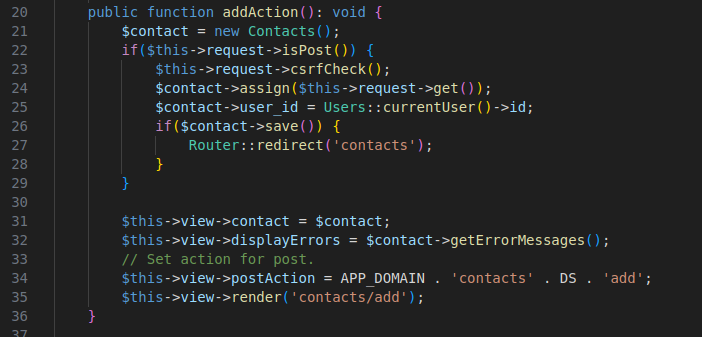
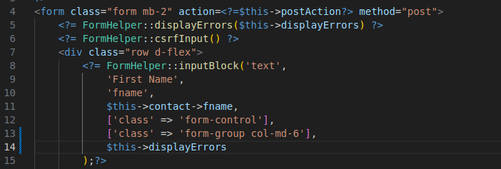
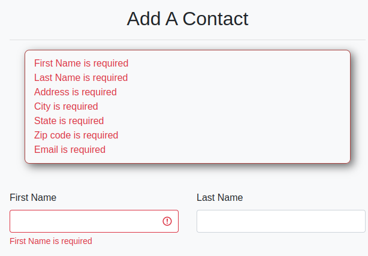

<h1 style="font-size: 50px; text-align: center;">Server Side Validation</h1>

## Table of contents
1. [Overview](#overview)
2. [Setup](#setup)
3. [Validation Rules](#validation-rules)
4. [Custom Validators](#custom-validators)
<br>
<br>

## 1. Overview <a id="overview"></a><span style="float: right; font-size: 14px; padding-top: 15px;">[Table of Contents](#table-of-contents)</span>
Server side validation supports the frameworks ability to check if values for an input field on a form meet specific requirements. The most commonly used check is required. A list of supported checks is shown below:
1. Email - checks if string is in valid email format.
2. Lower Character - Checks if a string contains at least 1 lower case character.
3. Matches - Used to check if two separate values match. Used when setting up password.
4. Max - Ensures value does not exceed maximum input size. (Requires rule - integer)
5. Min - Ensures value exceeds minimum input size. (Requires rule - integer)
6. Number - Checks if a string contains at least 1 numeric character
7. Numeric - Ensures value is a numeric character
8. Required - Ensures required value is entered into form
9. Special - Checks if a string contains at least 1 special character that is not a space
10. Unique - Checks database on form submit and verifies a value is unique (ex: user name)
11. Upper Character - Checks if a string contains at least 1 upper case character.
<br>

## 2. Setup <a id="setup"></a><span style="float: right; font-size: 14px; padding-top: 15px;">[Table of Contents](#table-of-contents)</span>
Let's use the addAction function from an example ContactsController class. As shown below on line 32, we have a displayErrors property for the View class. We generally set this value to a function call called getErrorMessages on the model. In this case, we are using the $contacts model because we want to add a new contact.

<div style="text-align: center;">
  
  <p style="font-style: italic;">Figure 1 - Controller side setup</p>
</div>

In the form you have two ways display errors:
1. At the very top after the opening form tag.
2. As an optional parameter in a function call to the FormHelper class for an input.

The form setup is shown below in figure 2.

<div style="text-align: center;">
  
  <p style="font-style: italic;">Figure 2 - Form setup</p>
</div>

The result of submitting a form without entering required input is shown below. Note the box above all for elements. All action items will be listed here. Notice that since we added $this->displayErrors as an argument for the FormHelper::inputBlock for first name that the same message is below it as well along with styling around the input field.

<div style="text-align: center;">
  
  <p style="font-style: italic;">Figure 3 - Front end messages</p>
</div>
<br>

<br>

## 3. Validation Rules <a id="validation-rules"></a><span style="float: right; font-size: 14px; padding-top: 15px;">[Table of Contents](#table-of-contents)</span>
First step is to create a validator function in your model class. The structure looks as follows:

```php
public function validator(): void {
    // Enter your validation function calls here.
}
```

You can easily create a model with this function already created from the console by running the following command:

```php console make:model ${Modelname}```

Let's use the MaxValidator for the First Name field in the Contacts model as an example:

```php
$this->runValidation(new MaxValidator($this, ['field' => 'fname', 'rule' => 150, 'message' => 'First name must be less than 150 characters.']));
```

The function call requires two parameters. The $this keyword and an associative array. Within the associative array you need to define the field, sometimes rule, and a message. Let's look at the field. Notice that it is a key value pair whose value is the database field or model class' instance variable called fname. The rule is similar and you can adjust the rule based on how you define this field in the database. Finally, the message key value pair is used to set the the language displayed to the user when validation fails. Within reason, industry standards always recommend utilizing both front end and server side validation.

You can also group several fields together and iterate through them with a foreach loop:

```php
$requiredFields = ['fname' => 'First Name', 'lname' => 'Last Name', 
    'address' => 'Address', 'city' => 'City', 'state' => 'State', 
    'zip' => 'Zip', 'email' => 'Email'];

foreach($requiredFields as $field => $display) {
    $this->runValidation(new RequiredValidator($this,['field'=>$field,'message'=>$display." is required."]));
}
```

This method requires a second associative array that contains the instance variables for your model mapped to a string that matches the label on your form. Then you iterate this array through a foreach loop where you create a new instance for the validator object you want to use.

<br>

## 4. Custom Validators <a id="custom-validators"></a><span style="float: right; font-size: 14px; padding-top: 15px;">[Table of Contents](#table-of-contents)</span>
You can create your own custom form validators with the following command:

```sh
php console make:validator ${validator_name}
```

An example output after running the command is shown below:
```php
<?php
namespace App\CustomValidators;
use Core\Validators\CustomValidator;
/**
 * Describe your validator class.
 */
class TestValidator extends CustomValidator {

    /**
     * Describe your function.
     * 
     * @return bool
     */ 
    public function runValidation(): bool {
        // Implement your custom validator.
    }
}
```

The validator files are simple and always implement the abstract function runValidation from the CustomValidator class.  It is a requirement that this function returns a bool value.