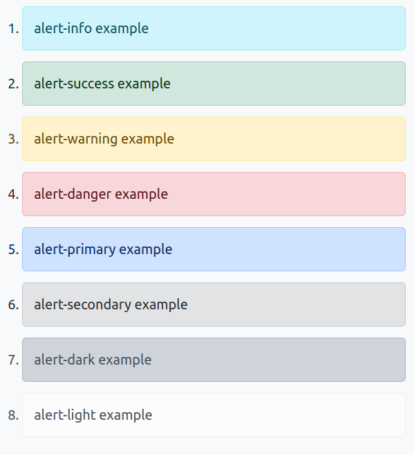
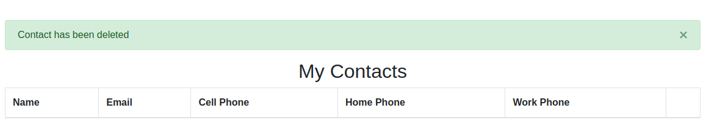

<h1 style="font-size: 50px; text-align: center;">Session and Flash Messages</h1>

## Table of contents
1. [Overview](#overview)
2. [Usage](#usage)
<br>
<br>

## 1. Overview <a id="overview"></a><span style="float: right; font-size: 14px; padding-top: 15px;">[Table of Contents](#table-of-contents)</span>
Session messages provides support for displaying information to the user in a div element styled using Bootstrap alert classes. Examples are shown below:

<div style="text-align: center;">
  
  <p style="font-style: italic;">Figure 1 - Available colors for flash messages</p>
</div>
<br>

## 2. Usage <a id="usage"></a><span style="float: right; font-size: 14px; padding-top: 15px;">[Table of Contents](#table-of-contents)</span>
When using with PHP you must first call the addMessage function form the Session class. An example for how to perform this task is shown below:

```php
Session::addMessage('success', 'Contact has been deleted');
```

The result of performing the action is shown below in Figure 1.

<div style="text-align: center;">
  
  <p style="font-style: italic;">Figure 1 - Alert success message</p>
</div>

Note that the user can close each message by clicking on the x button.

This same action can be completed using jQuery. The only difference is a popup message appears at the bottom of the screen with the message and disappears after 5 seconds. An example from where we use this to delete an image is shown below:

```javascript
function deleteImage(image_id) {
    if(confirm("Are you sure?  This cannot be undone!")) {
        jQuery.ajax({
            url : '/admindashboard/deleteImage',
            method: "POST",
            data : {image_id : image_id},
            success: function(resp) {
                if(resp.success) {
                    jQuery('#image_'+resp.model_id).remove();
                    updateSort();
                    alertMsg('Image Deleted.');
                }
            } 
        });
    }
}
```

The result of calling this function is shown below in Figure 2.
<div style="text-align: center;">
  
  <p style="font-style: italic;">Figure 1 - Alert info message</p>
</div>