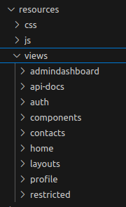

<h1 style="font-size: 50px; text-align: center;">Views Introduction</h1>

## Table of contents
1. [Overview](#overview)
2. [Links to Related Pages](#related-pages)
 
 

## 1. Overview [Table of Contents](#table-of-contents)
The View component of this Model View Controller framework contains several features.  Everything is standardized and customizable through tools such as layouts, standardized navigation, and components.  With built-in Bootstrap 5 support the user is able tailor layout based on their requirements.  Below are links to all of the resources available to assist in making your project need any visual requirement.

All php files that support views can be found at `resources/views` as shown in Figure 1.

  
  
Figure 1 - Default views directory

The organization is as follows.  Components directory contains reusable components that can be accessible within any view.  Your layouts are contained in the layouts directory.  Everything else are directories that contains views and their name matches that of a related controller except api-docs.  The api-docs directory does contain views but are automatically generated when the user performs the `php console make:api` command.  These docs are generated by a tool called doctum that creates Application Programming Interface (API) documentation based on phpdoc comments. 
 

## 2. Links to Related Pages [Table of Contents](#table-of-contents)
1. [api-docs and doctum API Generation](doctum)
2. [Components](components)
3. [Layouts](layouts)
4. [Navigation Bar](nav_bar)
5. [Pagination](pagination)
6. [Views](views)